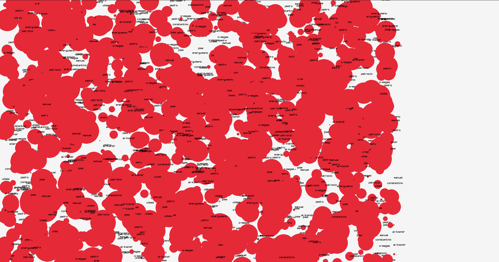

# BANKNEU
### a port in c++ of lifeeras(previous project)
## it uses raylib for its visual experience
[raylib library](https://github.com/raysan5/raylib)
## Compilation Steps (linux)
```bash
mkdir build
cd build
cmake ..
make -j4
```

